# John Farrell — Career Accomplishments

> **"Hi, my name is John. I build things. I'm an engineering manager and full-stack
> developer that builds both products and teams."**

A curated record of projects, products, leadership work, and testimonials spanning
~2002 to today. Every image referenced below lives in the `images/` folder beside this
file, using relative paths so the whole folder can be dropped straight into a portfolio
site.

**Two-track story:** John is both a *builder* (shipped products, founded a startup,
worked on recognizable high-traffic sites) and a *leader* (led a 12-person dev team,
managed engineers as an engineering manager).

**At a glance:** 15+ years of web development · 10+ years full-stack ASP.NET · 3+ years
of engineering leadership · sole developer for small businesses through to part of a
team of 20.

**Headline tech:** C#, ASP.NET / ASP.NET MVC / ASP.NET Core, Web API, Azure (Functions,
Cosmos DB), AngularJS / Angular, TypeScript, JavaScript, Knockout, SQL Server / T-SQL,
Entity Framework, RavenDB & MongoDB (NoSQL), CI/CD (TeamCity, Octopus, Gulp, GitHub),
unit testing (NUnit), Git.

**Strengths:** Leadership, communication, troubleshooting, problem-solving,
prioritization & time management, product management, working independently, Agile.

---

## Featured Products

### OneBag.Travel — founder & full-stack developer (2017–present)
An independently built, live web product for one-bag / carry-on travelers. It combines a
database of carry-on backpacks with ratings and reviews, user-generated packing lists for
over a dozen countries, and an airline carry-on rules reference tool. John designed,
built, and operates the whole thing end-to-end — including a professionally designed brand
and a rebuild on a modern serverless stack.

- **Role:** Founder, designer, full-stack engineer, operator
- **Tech:** ASP.NET Core, Azure Functions, Cosmos DB
- **Live:** https://onebag.travel/
- **Why it matters:** A real, live product owned start-to-finish — the strongest proof of independent product ability.

Fresh captures from the Internet Archive (Aug 2025 snapshot):

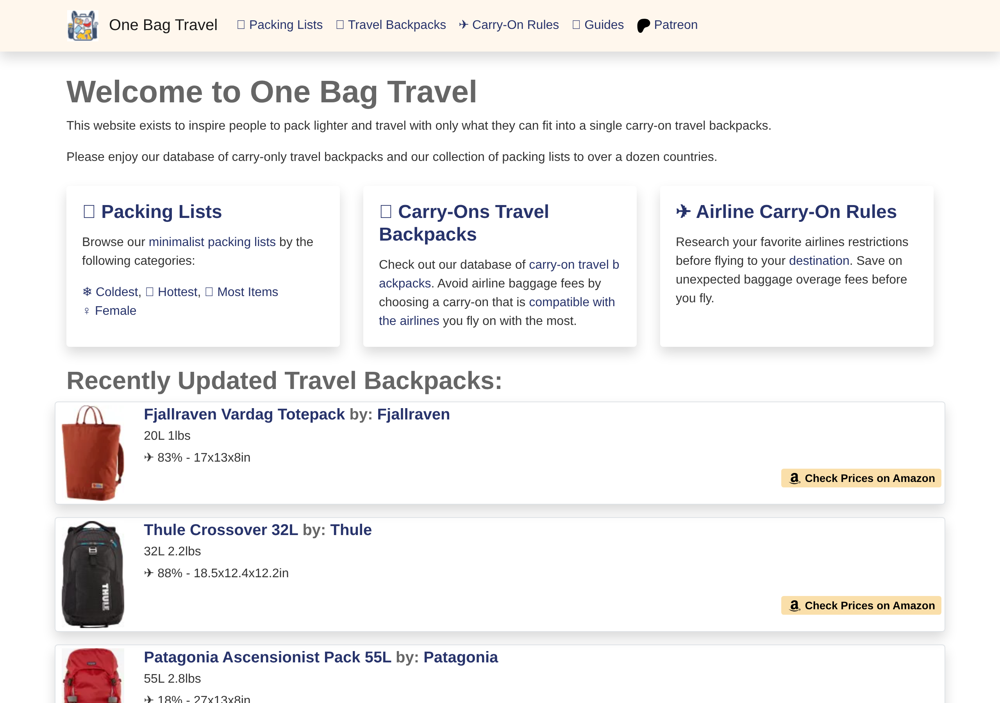
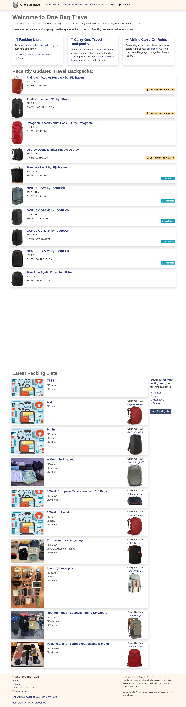

Earlier captures and brand:

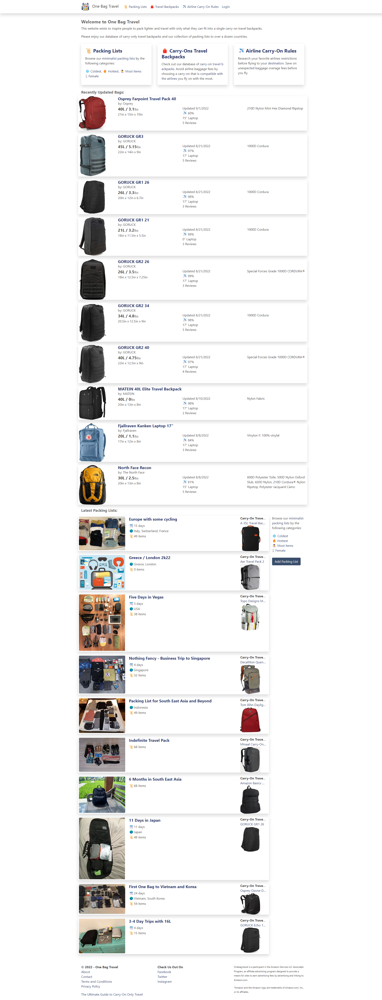
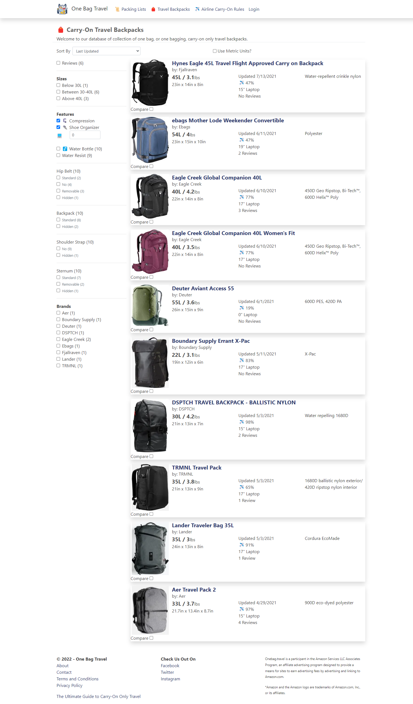

### Movid — CTO & Co-Founder (Home Exercise Plan Builder, 2012–2014)
Co-founded a healthcare/physical-therapy software startup and served as CTO. Led
full-lifecycle development from prototype to paying customers of the **Home Exercise
Plan (HEP) Builder** (app.movidhep.com) — a SaaS tool that helps physiotherapists
prescribe patients high-definition video home-exercise plans. As the sole developer,
John worked on everything from UI design to the NoSQL back end, with an Azure + GitHub
continuous-delivery pipeline and a performant graph search that wasn't practical on a
relational database. Featured for startup/website feedback (StartUpLift) and recognized
at startup events.

- **Role:** CTO & Co-Founder (sole developer)
- **Tech:** ASP.NET MVC, AngularJS, Knockout, RavenDB (NoSQL)
- **Why it matters:** Founder-level ownership, a real product with paying customers, and startup recognition.

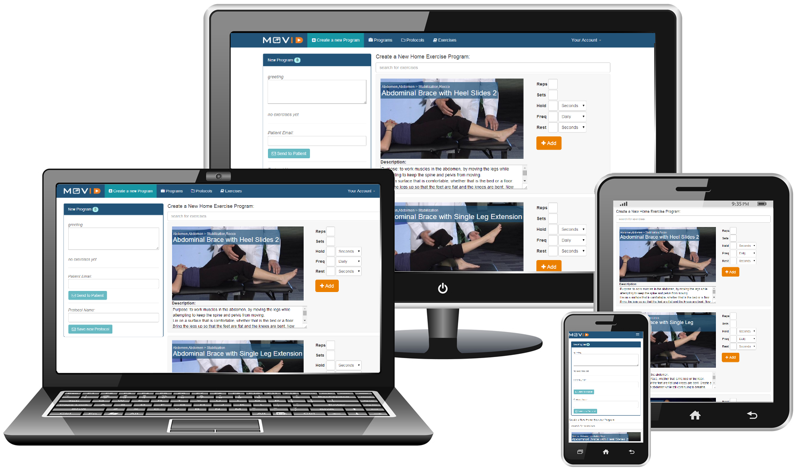
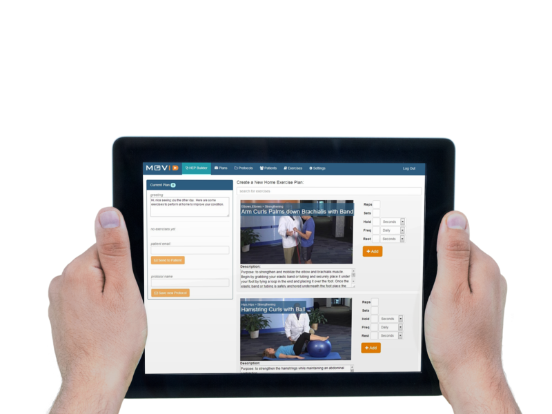
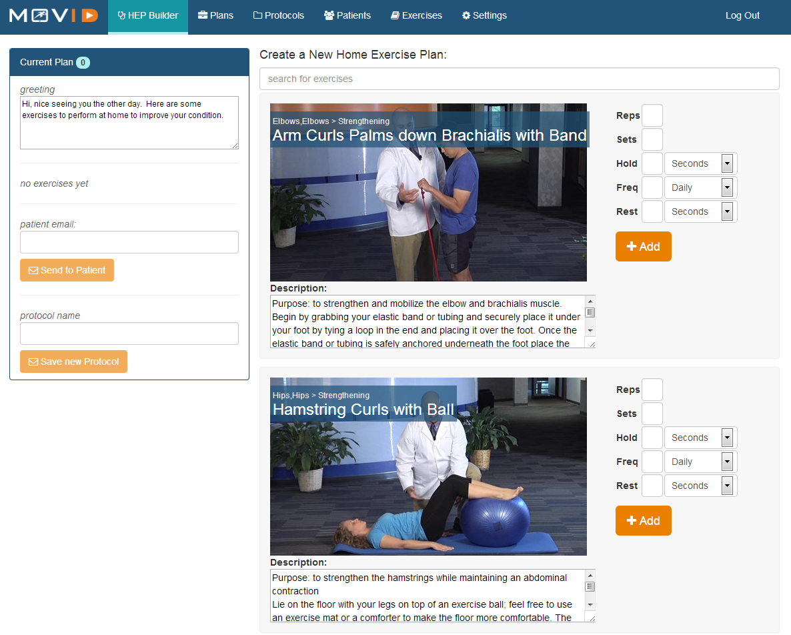
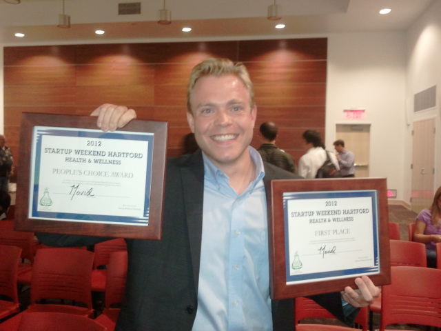
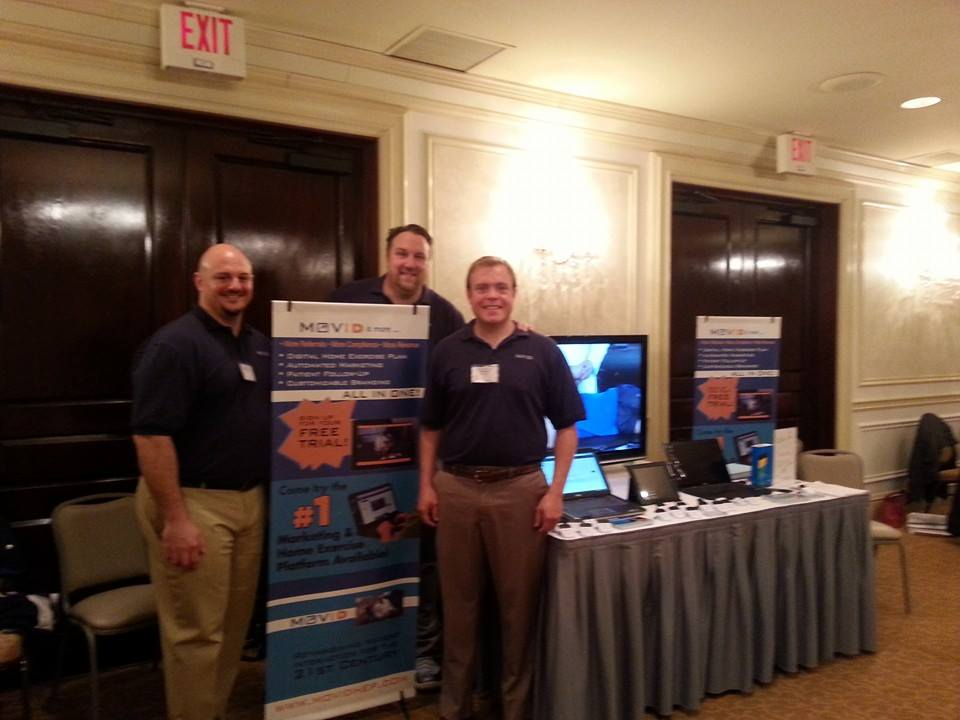

### Terraforming Mars Cards — side product (2018–present)
A reference/informational website for the board game Terraforming Mars.

- **Tech:** Angular, TypeScript, Bootstrap
- **Live:** https://terraformingmars.cards/

### Brainnom — "brain foods" content product
A content-driven site cataloging foods and their cognitive benefits, with a library of
researched food articles. Knockout.js front end. A complete, self-directed side project.

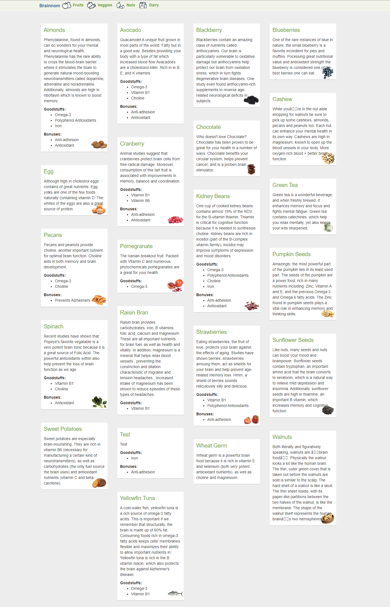
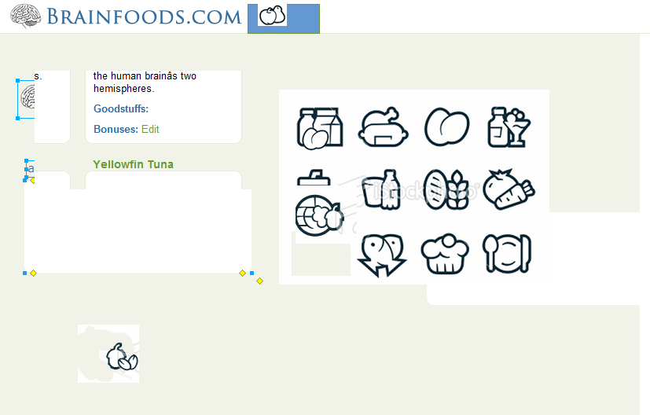

---

## Engineering Leadership

### Resilia — Engineering Manager (~2020)
Led and managed a team of engineers as an Engineering Manager. The standout artifact is a
farewell card in which the whole team independently described what it was like to work for
John — repeatedly using words like *leader*, *advocate*, and *compassionate*. Unusually
strong, authentic social proof of people-leadership.

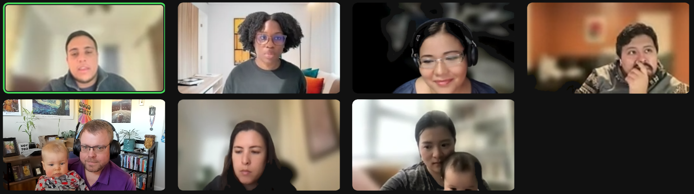
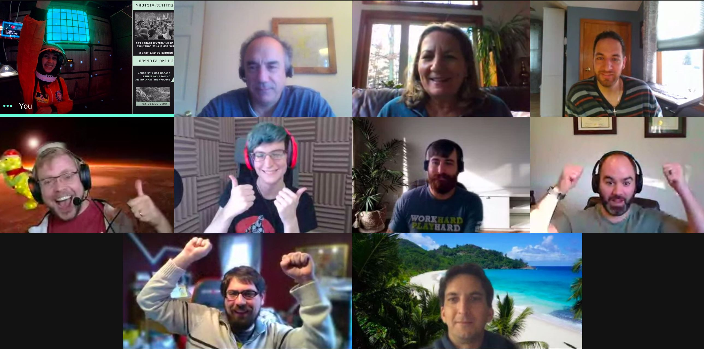
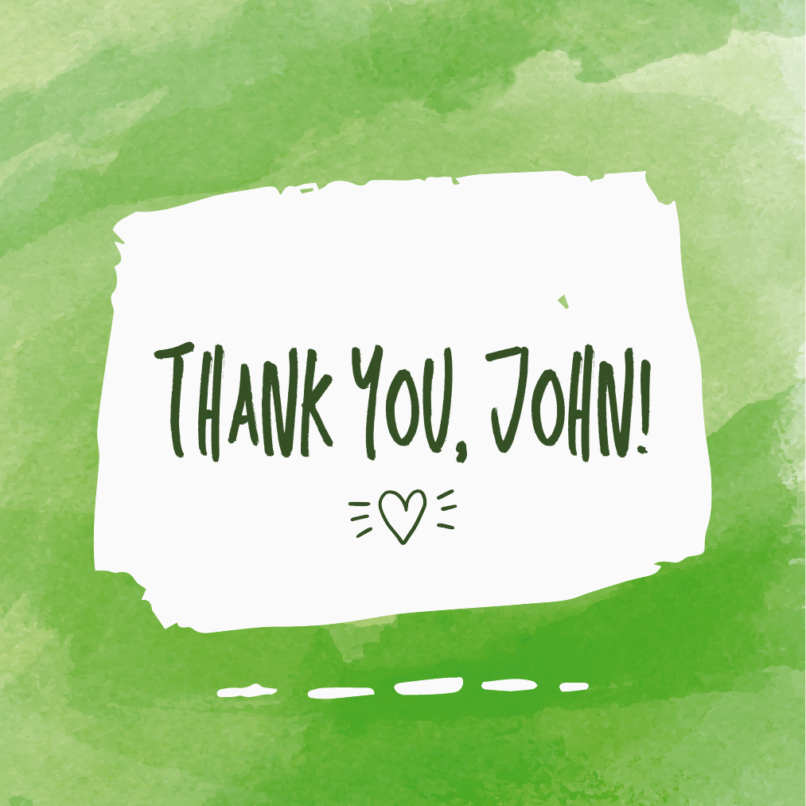
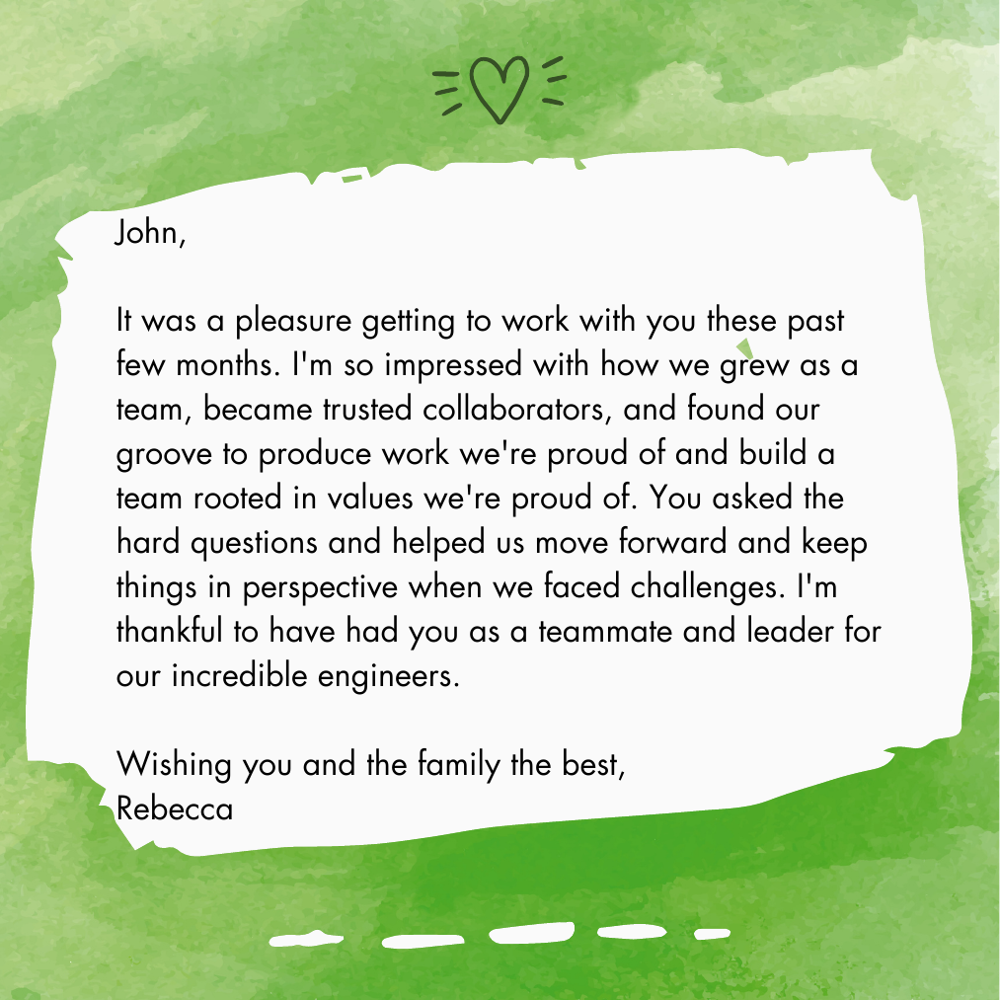

> "I'm so impressed with how we grew as a team... You asked the hard questions and helped
> us move forward and keep things in perspective when we faced challenges. I'm thankful to
> have had you as a teammate and leader for our incredible engineers." — Rebecca, Resilia
>
> "Thank you for being a great manager and advocate. You showed what it means to be a
> compassionate leader." — Amanda, Resilia
>
> "It was a fantastic experience to see you in action as a leader with the team, the other
> engineers, and the whole company." — Jared, Resilia
>
> "You were the best manager anyone could have coming back from maternity leave... Thank
> you for showing me that parents can still have other identities!" — Taihua, Resilia
>
> "Thank you for showing up — as a leader, as a teammate, and as a person. We were lucky
> to have you." — Dawn, Resilia

### Best Time Entertainment, LLC (BTE) — Lead Developer & Architect (2015–2017)
Lead developer and architect for a high-performing C#, ASP.NET MVC, AngularJS, and SQL
Server web application. **Hired, cultivated, and coordinated a team of twelve technical
employees** (and was part of a crew of up to ~20). Engineered a multi-environment DevOps
pipeline (Gulp, TeamCity, Octopus Deploy) for continuous integration and deployment, and
shaped a modern agile process with code reviews, peer mentoring, unit testing, and front-
and back-end standards. Internal retrospectives show John actively running process for a
distributed team — requirements clarity, code-review structure, Jira/Trello workflow, and
cross-language communication. (Earlier engagement 2013–2015 as a freelance consultant.)

- **Products from this era:** the **HCRT** iPad sales tool, the **Hype** event app, and **Dropwatch**.

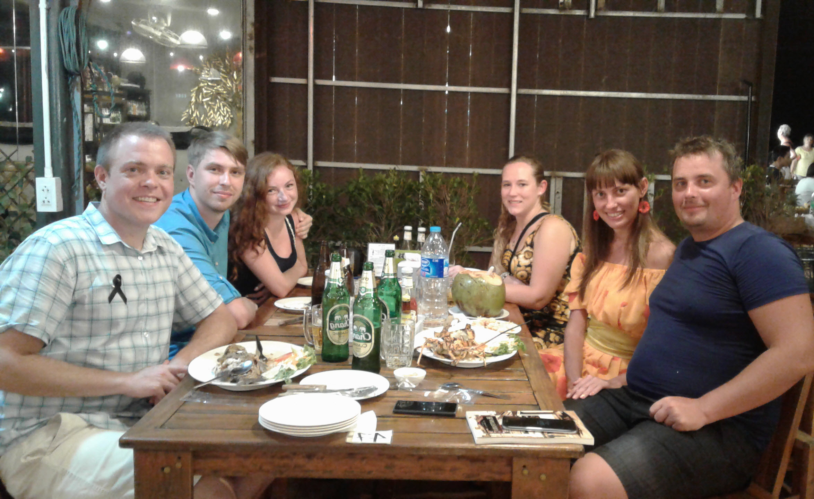
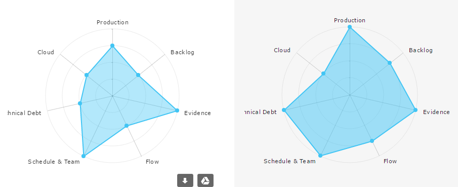

#### HCRT — iPad mobile sales tool (2016)
A responsive, data-rich iPad sales tool. **Tech:** AngularJS, D3, responsive CSS.

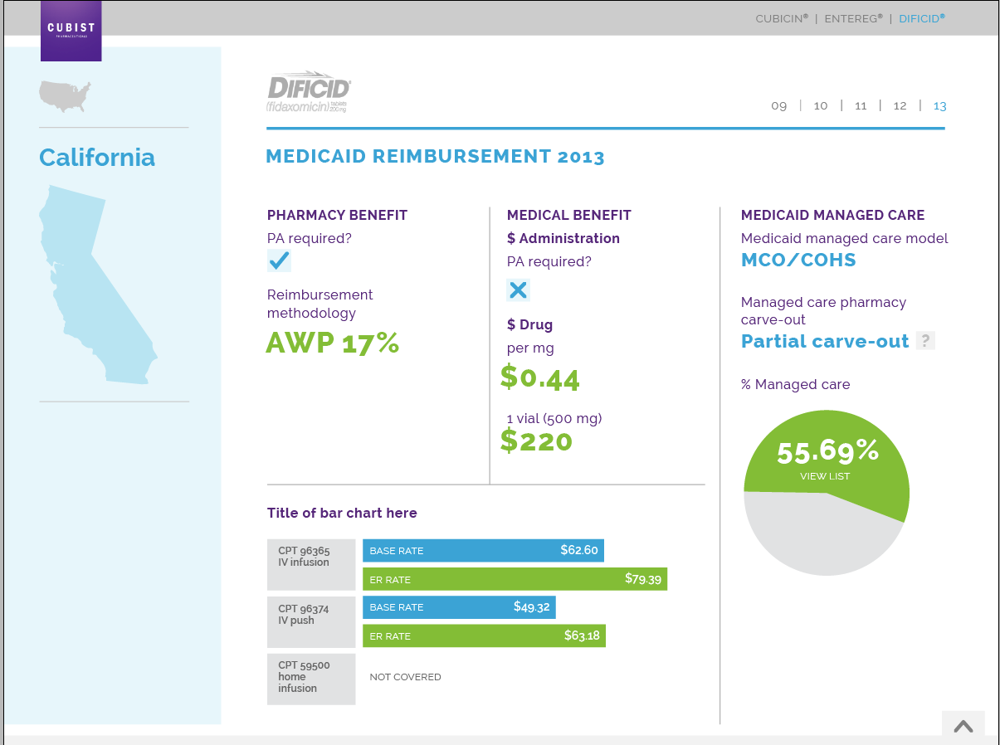

#### Hype — mobile event app (events.hypehartford.com/reg)
Hartford Young Professionals & Entrepreneurs needed to track event attendance and let
attendees pay and check in on-site. Almost entirely JavaScript with a thin web-services
layer over a legacy FoxPro database. "The coolest software launch I've ever had — signs,
banners and everything." **Tech:** ASP.NET MVC, JavaScript, jQuery, jQuery Mobile, Classic ASP.

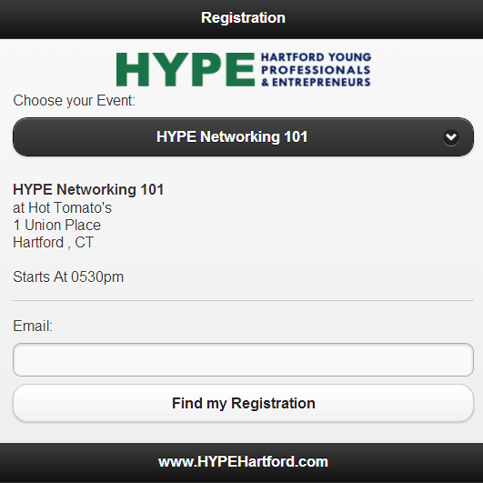

---

## Selected Professional Experience

### PowerInbox — Senior Full-Stack Engineer (~2017–2019)
Full-stack engineer on PowerInbox's ad-tech "Portal" and "Builder" products. Spearheaded
the migration toward Angular 2 (taking dedicated training), delivered builder features
that reduced the PubOps team's development time, and drove UI/UX improvements across the
Portal. Led proactive capacity/scaling analysis — pulling Google Analytics, Raygun,
Application Insights, and SQL growth data to model user growth and plan for scale. Granted
incentive stock options as a valued, retained engineer.

> "John is an excellent full stack software engineer all around... He's got some good UI
> and JavaScript skills which are often difficult to find." — Performance review, PowerInbox (2018)
>
> "His walkthrough/explanation videos show he's really thinking about how people will
> interact with a feature and the end result that's achieved." — Performance review, PowerInbox (2018)

### CNC Software (Mastercam) — ASP.NET MVC Developer (2014–2015)
Built a single-page application with a modern UI (ASP.NET MVC, Web API, AngularJS, SQL
Server, Entity Framework) to extend an aging intranet portal, and architected software to
let third-party libraries integrate with internal APIs across business units. Test-first
development with NUnit, StyleCop, and NCover.

### Guitar Center — High-traffic e-commerce (via John Becker Solutions, 2010–2012)
Worked across Guitar Center's portfolio of e-commerce sites (guitarcenter.com,
musicarts.com, wwbw.com) — a top-1000-trafficked property. Re-engineered a half-finished,
buggy customer-loyalty system: built a unit-test suite, improved performance, and shipped
it (refactoring ~30k lines down to ~5k). Also built back-office administration for
promotions and customer support, including jobs to synchronize employee data and reporting
over complex data structures. Also created a social-media / TV-guide mashup app (jQuery
Mobile, MongoDB) **demoed at CES 2011 and presented to Panasonic executives.**

### TeacherLingo — P2P e-commerce (teacherlingo.com)
A peer-to-peer marketplace where teachers buy and sell lesson plans. Added line-of-business
and user-administration features, UI improvements, and new user-onboarding to a legacy
Community Server codebase. **Tech:** ASP.NET, Community Server, SQL 2008, PetaPoco.

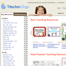

### Order Management for Small Business
Streamlined a manual, paper-intensive process into a digital system the business uses
daily to manage incoming orders and customer support. Built to run alongside a third-party
SQL Server database without compromising the integrity of that data. **Tech:** ASP.NET
MVC, JavaScript, jQuery, PetaPoco, Bootstrap.

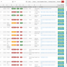

### PageFad — ASP.NET Web Developer (2008–2009)
Built large-scale sports-simulation social games serving **26 million unique users per
month**, and tuned high-traffic OLTP SQL Server databases for performance and reliability.

### Freelance / Consulting (2010–2015)
Enabled a client business to **grow revenue by over 100%** with a custom ASP.NET MVC /
AngularJS / SQL Server application; modernized a legacy Adobe Flex UI to HTML5/CSS3; built
a custom SOA CRM; and integrated manufacturing sensors with a legacy system that **reduced
shipping errors by over 10%.**

### Earlier roles
- **UConn Health Center** — Contract ASP.NET Developer (2009–2010): built an ASP.NET MVC framework for future UCHC web apps and mentored staff on MVC and ORMs.
- **Intergis** — System Support Engineer / Junior Developer (2007–2008): T-SQL optimization and C# ASP.NET intranet projects.

---

## Testimonials

> "Sometimes you come across an individual who really makes you question your own
> abilities. John is such a person. He produces excellent quality code using the right
> technology and truly understands the depths of the technology that he is utilizing."
> — **Mark Adams**, Senior .NET Developer & Application Architect
>
> "John is an excellent programmer with an in-depth grasp of the entire ASP.NET MVC
> framework as well as Entity Framework. It was a pleasure to work with him."
> — **David Melinosky**, Business Systems Developer, CNC Software
>
> "He is a talented IT professional who consistently receives positive feedback on his
> work and has been requested to return to client sites as additional needs arise... one
> of my most marketable candidates." — **Lisa Drew**, Senior Technical Recruiter
>
> "John has done an extraordinary job of sitting down with me, analyzing my problems, and
> using outside-the-box thinking to solve them... The main application he created has
> completely streamlined my operation. I couldn't imagine not having it."
> — **Ryan Andrew**, Small Business Owner & Client
>
> "One of the brightest programmers I have ever had the pleasure to work with. His
> abilities in the .NET world, and in all other aspects of programming, are remarkable."
> — **Jack Lotko**, Application Developer, UConn Health Center
>
> "Hired as a junior developer but quickly proved himself to be much more knowledgeable...
> his knowledge of web development is his greatest attribute. I would definitely work with
> him again." — **Jeff Gadoury**, Software Developer (PageFad)

---

## Client & Freelance Web Work (gallery)
A sampling of freelance/agency sites delivered over the years — useful as a "client work"
strip on a portfolio.

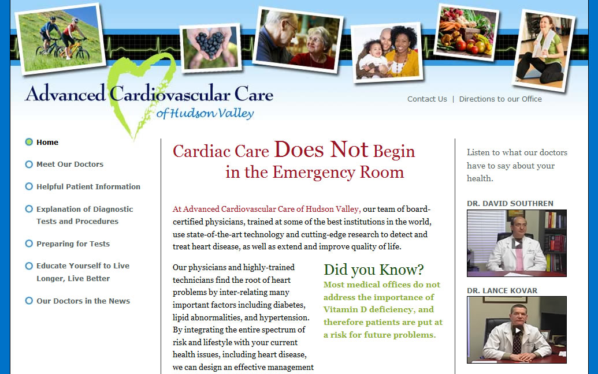
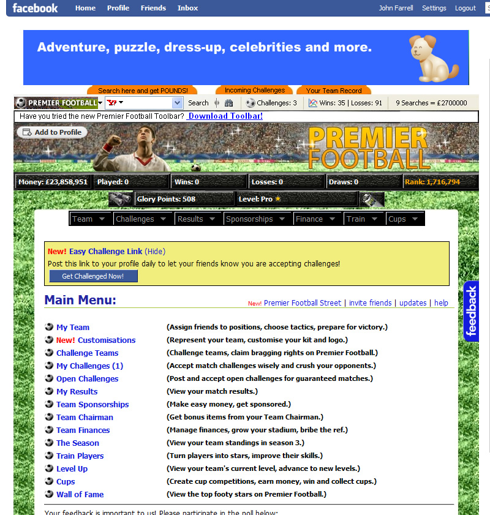
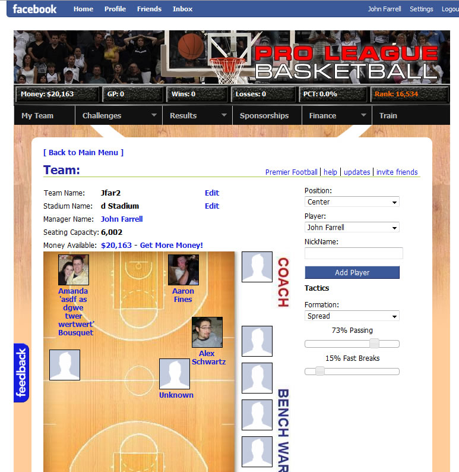
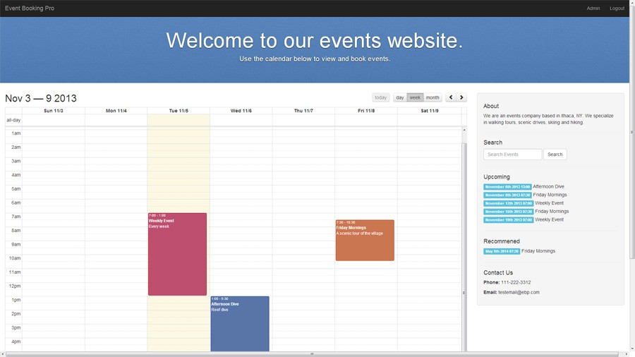
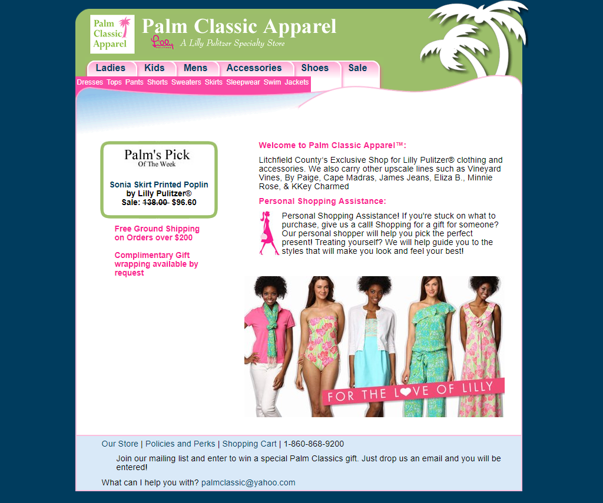
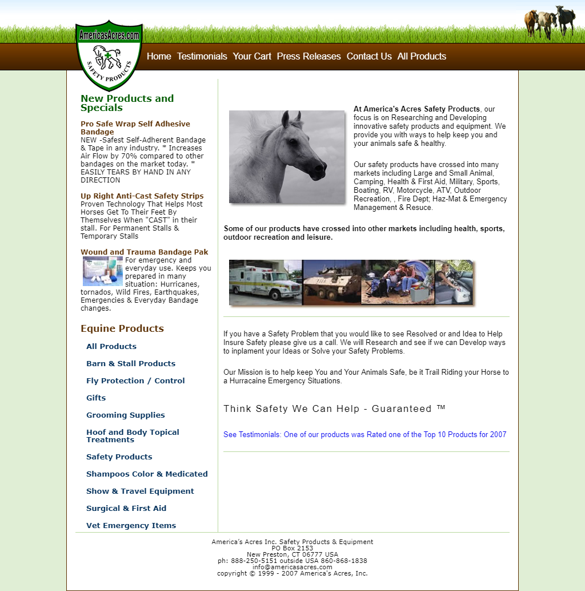
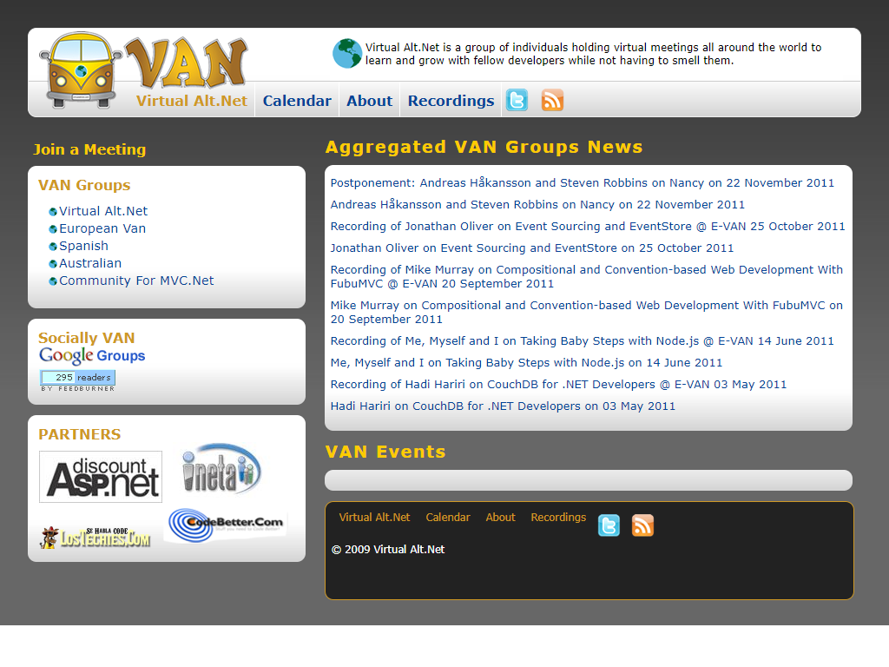

---

## Entrepreneurship, Community & Volunteer Work
- **hearye.io (2013)** — Ran a digital-marketing / social-media agency; authored a paid event-promotion proposal for the Bushnell Park Foundation's Solstice Party.
- **Bi-City Startup Weekend, Hartford (2013)** — Organizing-committee member for an ambitious "bi-city" Startup Weekend, alongside regional civic and tech leaders.
- **HYPE (Hartford Young Professionals & Entrepreneurs)** — Active in the Hartford startup/entrepreneurship ecosystem.
- **Bushnell Park Foundation (bushnellpark.org)** — Volunteer: WordPress page design and maintenance for the non-profit. **Tech:** PHP, WordPress.

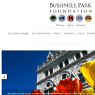

---

## Origin Story (the long arc)
John has been building for the web since he was a teenager. These early-2000s projects are
charming proof of a lifelong builder — best used on an "About" page rather than as headline
work.

- **Enraged Creations (~2002)** — Early game/web development venture (captured via the Internet Archive).
- **Halo community sites** — bloodgulch.com, lekgolosv2.com, and ninjasonfire.org: fan/community sites built in the mid-2000s.

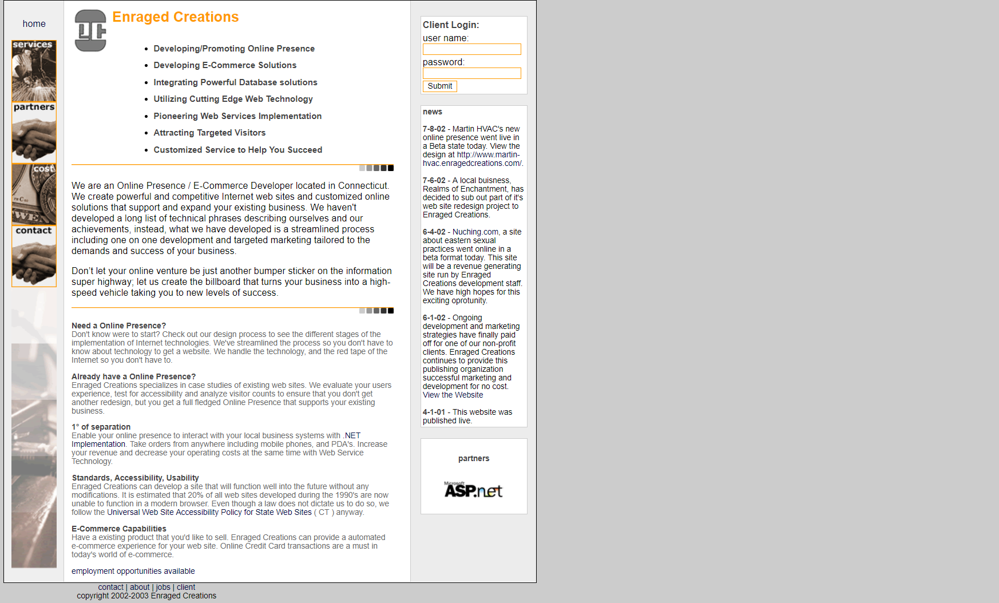
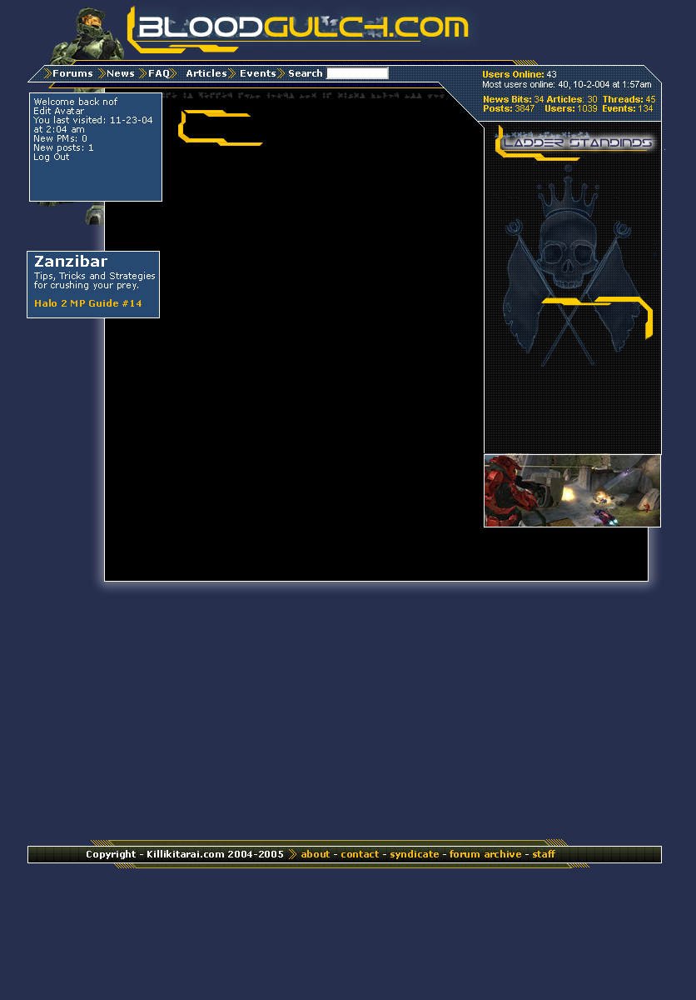
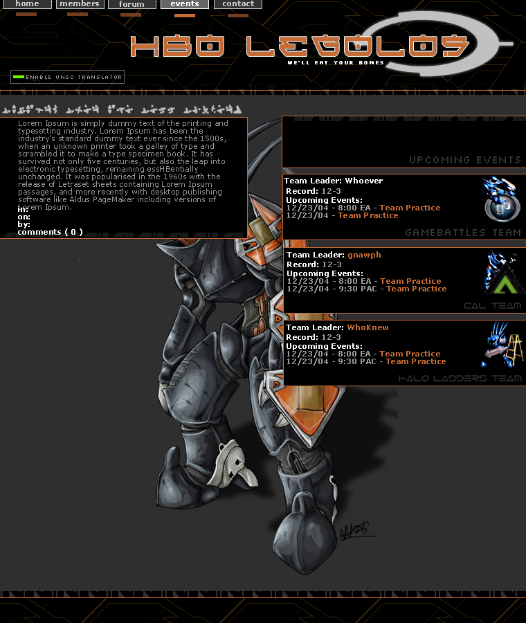
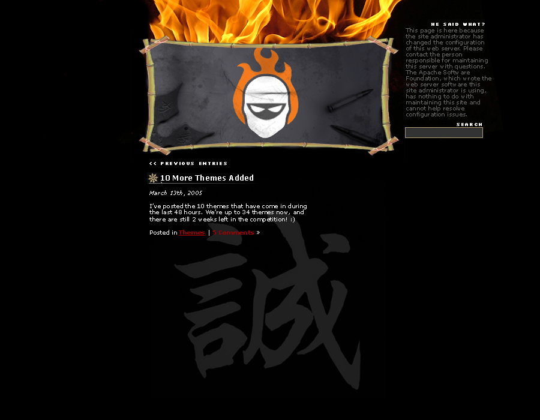

---

## Suggested portfolio ordering
1. **Hero / About** — headshot (`images/john-farrell.png`), the "I build products and teams" tagline, the at-a-glance stats.
2. **Featured products** — OneBag.Travel (lead with the fresh 2025 archive shots), Movid (CTO/co-founder), Terraforming Mars Cards, Brainnom.
3. **Leadership** — Resilia (with testimonials) and BTE (team of 12, Thailand offsite, DevOps).
4. **Experience highlights** — PowerInbox, CNC/Mastercam, Guitar Center, PageFad scale.
5. **Testimonials** — the six professional quotes.
6. **Client work gallery** — the freelance strip.
7. **Community & origin** — entrepreneurship/volunteer work and the early-2000s story.

> Notes: `images/john-farrell.png` is a headshot for hero/about use. The two
> `onebag-archive-2025-*.png` files were freshly captured from the Internet Archive's
> Aug 2025 snapshot of onebag.travel.
